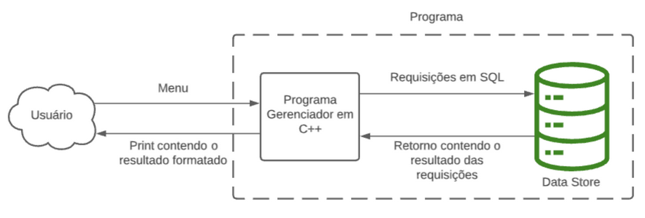
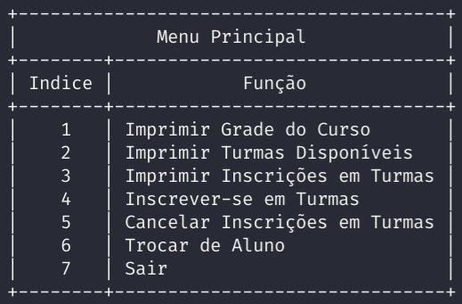
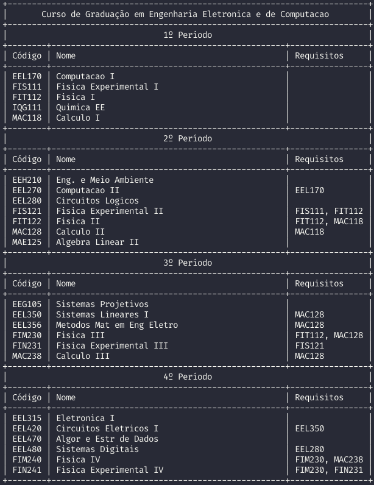

# Gerenciador de Inscrição em Disciplinas
## Descrição:
Este projeto foi desenvolvido durante o curso Linguagens de Programação presente na grade de Engenharia Eletrônica e de Computação da UFRJ.

## Objetivo
O objetivo deste programa é fornecer um sistema de gerenciamento de inscrições em disciplinas em um contexto universitário. Ou seja, viabilizar que alunos façam suas inscrições de maneira virtual e autônoma, visto que o programa tratará diversas políticas de validação para as inscrições conforme normas da universidade.

## Funcionamento:

### Panorama:

O programa consiste de:
1. Um menu para interação com o usuário
2. Um sistema principal gerenciador em C++,
3. Um banco de dados SQL;

## Funcionalidades:

* Exemplo de Grade

